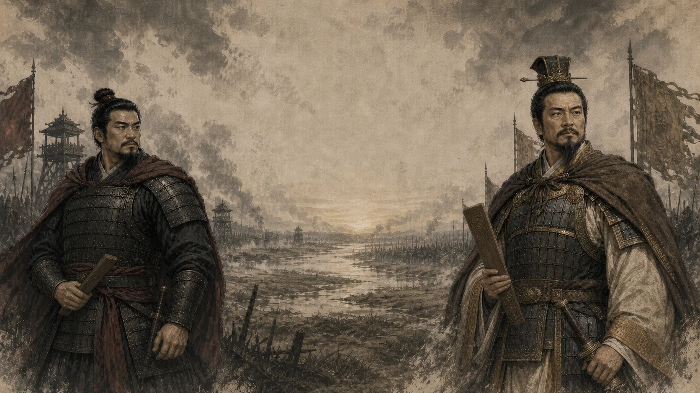

<div align="center">

# 魏武：官渡

### 一场三阵两胜的官渡军势推演——牌要会打，兵也要会收。

[](https://boboli121.github.io/weiwu-guandu/)
[](https://github.com/boboli121/weiwu-guandu)

</div>

<p align="center">
  <a href="https://boboli121.github.io/weiwu-guandu/">
    
  </a>
</p>

> [!IMPORTANT]
> **不想先看说明书？这很符合曹老板的用人风格。** 直接点击：
> ## [⚔️ 进入 GitHub Pages，立即在线试玩](https://boboli121.github.io/weiwu-guandu/)
>
> 无需下载、无需安装，现代桌面浏览器打开就能玩。

## 这是个什么游戏？

《魏武：官渡》是一款以官渡之战为背景的单人网页卡牌游戏 Demo。

你将站在曹操一方，从许都点兵出发，经历白马、延津、乌巢与官渡等历史节点。一路上不只有正面交锋，还要招募新军、裁撤疲兵、选择军令，并决定什么时候狠狠干一仗，什么时候体面地说一句：

> “此阵先让你高兴，下一阵再算总账。”

核心体验可以概括为：

- **三阵两胜**：不是每一阵都必须赢，先拿到两枚胜印才是最后赢家。
- **三列布阵**：前军、中军、后军各有位置限制和战术意义。
- **跨阵资源管理**：没打出去的手牌会保留到下一阵，别第一阵就把家底扬了。
- **卡牌联动**：骑兵移动、侦察牌序、潜伏敌阵、断后反击、屯田成长与火攻持续伤害。
- **战役选择**：事件、招募、休整与军令会影响后续战斗，不只是点点点然后看数字变大。

## 三分钟上手

### 1. 开战前：调整手牌

每场战斗会先进入换牌阶段，你最多可以选择三张牌换掉。

不要看到高战力就全部留下。发动机卡、补牌卡和能与当前战术配合的牌，往往比一张孤零零的大数字更值钱——当然，如果你特别相信玄学，也可以全部不换，然后把锅甩给军师。

### 2. 轮到你时：三选一

每次行动可以：

1. 打出一张牌；
2. 发动一次主将军令；
3. 主动收兵。

卡牌只能部署到允许的军列。普通单位通常放在曹军一侧；潜伏和火攻牌则要点选袁军军列。界面会标出可用位置，实在点不下去时，先别怀疑鼠标，看看是不是军令不许。

### 3. 比较战力：数字大的一方拿下本阵

双方轮流行动并累积场上总战力。当双方都收兵后，本阵战力更高的一方获得一枚胜印。

一场战斗最多三阵，**先取得两枚胜印者获胜**。主动收兵会结束你在本阵的行动，但剩余手牌可以带到后阵，所以：

- 对手已经投入大量兵力？可以考虑让他赢得很贵。
- 自己领先不少？早点收兵，别为了赢十点把整副牌都倒桌上。
- 双方差距很小？欢迎进入经典环节——“我觉得他没牌了”和“他居然还有”。

### 4. 战后：别急着喝庆功酒

战斗之外还有战役节点：

- **事件选择**：不同决策会改变后续遭遇和战术资源。
- **招募整编**：从三名战后招募者中选择一张，永久加入本轮牌组。
- **营帐休整**：裁撤一张基础非武将牌，让牌组更精炼。
- **军令研习**：选择适合骑兵、屯田或间谍体系的主将强化。
- **决战官渡**：把前面做过的所有选择带进最终战场，然后接受自己当初决策的凝视。

## 认识你的军队

| 类型 | 怎么用 | 一句话军情 |
| --- | --- | --- |
| 武将 | 提供稳定战力和关键部署效果 | 能打，也通常很会带人一起打。 |
| 部曲 | 构成牌组主体，靠标签和军列形成联动 | 单看平平无奇，凑在一起就开始报菜名。 |
| 计策 | 打出后立即结算，不占军列 | 没有战力，但能让对面的战力突然变得很有历史感。 |
| 主将军令 | 每场战斗一次的主动技能 | 别忘了用，也别在无关紧要的时候帅气地浪费掉。 |

## 特色机制

### 骑军联动

轻骑斥候、曹纯、虎豹骑与夏侯惇会围绕“移动”产生连续效果。合理安排出牌顺序，骑兵可以转列、强化并发动突击；顺序不对时，则会表演一场非常写实的古代交通拥堵。

### 侦察

查看牌库顶部若干张牌，并可将其中一张放到牌库底。它不会凭空变出神牌，但能减少下一抽看到“怎么又是你”的概率。

### 潜伏与间谍

潜伏单位会部署到袁军阵中，暂时为对方计算战力，但所有权仍然属于你，并可能带来抽牌或伏击收益。送分只是表象，搞事才是本职。

### 断后与主动收兵

断后牌会在你主动收兵前发动攻击或反击。会撤退不等于认输，有时候只是让对面追得更不体面。

### 屯田

屯田是跨阵成长机制。只要战斗继续，它会在阵间逐步发展，后续调集更强的新军。第一阵种田，第三阵收租。

### 火烧乌巢

火攻袁军后军，并留下持续燃烧的火势。袁军继续出牌或发动军令时，火势会反复灼伤目标。温馨提示：本游戏没有消防演习，但有非常充分的历史经验。

## 新手军师锦囊

- **别把每一阵都当决赛。** 三阵两胜的核心是让对方付出更多手牌，而不是场场追求碾压。
- **先读军列限制。** 前军、中军、后军不是三个长得很像的停车位。
- **注意出牌顺序。** 骑兵移动、突击和部署效果经常需要前置条件。
- **潜伏牌要点敌方军列。** 它暂时给敌人加分是设计，不是程序叛变。
- **悬停查看卡牌札记。** 按一下 `Alt`，Mac 上按 `Option`，可以固定当前说明。
- **进度会自动保存。** 事件、招募、休整和战斗结算后都会记录；战斗中刷新会从该场战斗的换牌阶段重新开始。
- **第一次建议完成许都教学。** 几分钟就能认识换牌、收兵、屯田、间谍和骑军联动，略过以后也能在设置里重演。

## 操作方式

| 操作 | 效果 |
| --- | --- |
| 点击手牌 | 选中准备部署的卡牌 |
| 点击高亮军列 | 部署单位、潜伏或施放计策 |
| 悬停卡牌 | 查看完整能力和关键词说明 |
| `Alt` / `Option` | 固定当前卡牌札记 |
| 右下角齿轮 | 调整设置、重演教学或重新开始 |

游戏进度保存在当前浏览器的本地存储中。换浏览器、使用无痕窗口或清理站点数据，都可能让曹老板再从许都点一次兵。

## 在线试玩

### [▶ 点击这里打开 GitHub Pages 在线版](https://boboli121.github.io/weiwu-guandu/)

如果进入后看到首页，点击 **“新开一卷”** 即可开始。推荐使用电脑浏览器游玩，给军报、卡牌札记和曹袁两家的排面留一点空间。

## 玩完以后，劳烦主公做两件小事

### ⭐ 点一个 Star

如果你觉得这个项目有点意思，请回到[项目主页](https://github.com/boboli121/weiwu-guandu)，点击右上角的 **Star**。

Star 不会让曹操战力 +2，但会让开发者士气 +20，并显著提高继续更新的概率。这大概也是一种主将军令。

### 💬 留下评论或战报

遇到 Bug、规则看不懂、发现离谱套路，或者只是想说“袁绍怎么还有牌”，都欢迎在 [Issues](https://github.com/boboli121/weiwu-guandu/issues) 留言。

反馈时如果方便，可以附上：

- 你进行到哪个节点或哪场战斗；
- 当时发生了什么；
- 你原本期待发生什么；
- 截图、浏览器名称，以及那张让你血压升高的牌。

## 本地预览

仓库根目录就是已经构建好的静态站点，不需要安装依赖。克隆后运行任意静态文件服务器：

```bash
git clone https://github.com/boboli121/weiwu-guandu.git
cd weiwu-guandu
python3 -m http.server 8080
```

然后访问：

```text
http://localhost:8080
```

也可以直接部署到 GitHub Pages、Netlify 或其他静态托管平台。入口文件为 `index.html`。

## 当前状态

这是一个可完整在线体验的玩法 Demo，重点展示官渡战役流程、三阵两胜对局、牌组成长和魏军特色机制。数值、文案、界面与事件仍可能继续调整。

如果你愿意试玩、反馈，甚至只是在仓库门口点个 Star 再走，都非常感谢。

**愿诸君落子有谋，收兵有度，神抽有时。我们官渡见。**

